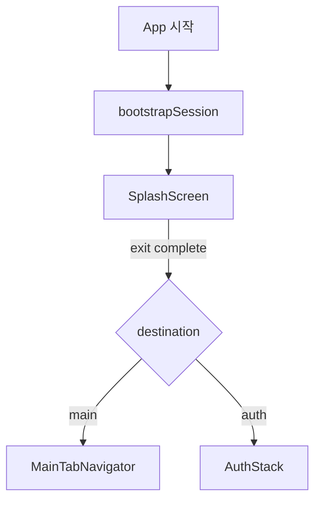

## 📝 Introduction

**BETA-Client**는 BETA 서비스의 **사용자용 모바일 앱(React Native)** 클라이언트입니다.

- Expo 기반으로 개발/빌드되며, `expo-dev-client`를 사용해 네이티브 모듈(Firebase, Vision Camera, 소셜 로그인 등)을 포함한 개발 흐름을 지원합니다.
- 화면 전환은 React Navigation으로 구성되어 있고, 서버 상태는 TanStack Query, 앱 상태는 Zustand를 중심으로 관리합니다.
- API Base URL 및 소셜 로그인 설정은 **환경변수 → `app.config.js`의 `expo.extra`**로 주입됩니다.


## 🛠️ Tech Stack

| Category | Stack |
| --- | --- |
| **Core** |    |
| **Navigation / State** |    |
| **Styling** |  |
| **Networking** |   |
| **Push / Native** |   |
| **Social Login** |    |


## 🧩 Project Structure

주요 디렉터리는 아래 구조로 관리합니다.

| Path | Description |
| --- | --- |
| `src/app/` | 앱 엔트리, Provider 구성, 네비게이션 루트 |
| `src/features/` | 도메인/화면 단위 기능 모듈 (auth, home, community, search, profile, photoBooth 등) |
| `src/shared/` | 공통 컴포넌트/유틸/스토어/서비스(API, 세션, 푸시 등) |
| `assets/` | 앱 아이콘/스플래시 등 정적 리소스 |


## 🏛️ Architecture

### App Bootstrap Flow

앱 시작 시 세션을 준비한 뒤, 스플래시 종료 시점에 `Auth` 또는 `Main`으로 분기합니다.




### API Base URL Resolution

API baseURL은 TestFlight/런타임 환경 차이를 고려해 아래 우선순위로 결정됩니다.

1) `Constants.expoConfig.extra.backendUrl` (권장)  
2) `process.env.EXPO_PUBLIC_BACKEND_URL`  
3) fallback: `https://beta-app.kr`

관련 구현은 `src/shared/libs/api.js`에서 관리합니다.


## 🔐 Environment Variables

로컬 개발은 `.env.local`을 사용합니다. (레포에는 커밋하지 않는 것을 권장)

`.env.local`을 생성한 뒤 값을 채웁니다.

| Key | Description |
| --- | --- |
| `EXPO_PUBLIC_BACKEND_URL` | 백엔드 API Base URL |
| `NAVER_CLIENT_ID` | 네이버 로그인 Client ID |
| `NAVER_CLIENT_SECRET` | 네이버 로그인 Client Secret |
| `NAVER_APP_NAME` | 네이버 앱 이름 |
| `NAVER_IOS_URL_SCHEME` | iOS URL Scheme (네이버 로그인) |

`app.config.js`가 `.env`와 `.env.local`을 병합 로드하고, `expo.extra`로 주입합니다.


## ▶️ Getting Started

### Install

```bash
npm install
```

### Run (Expo)

```bash
npm run start
```

### Run (Dev Client)

네이티브 모듈이 포함되어 있으므로, 디바이스/시뮬레이터에서 dev-client로 실행합니다.

```bash
npm run ios
npm run android
```


## 🚀 Build & Release (EAS)

본 프로젝트는 `eas.json` 기준으로 `development / preview / production` 프로파일을 운영합니다.

| Profile | Purpose | Channel |
| --- | --- | --- |
| `development` | 내부 개발 빌드 (dev-client) | `development` |
| `preview` | QA/검증용 내부 배포 | `preview` |
| `production` | 프로덕션 배포 | `production` |

예시:

```bash
eas build --profile development --platform ios
eas build --profile preview --platform android
eas build --profile production --platform ios
```


## 📌 Notes

- iOS Push/FCM 관련해서 `aps-environment` 값은 `EAS_BUILD_PROFILE`에 따라 자동 설정되며, 네이티브 설정 변경이 필요한 경우 prebuild 후 재빌드가 필요합니다. (`app.config.js` 참고)

